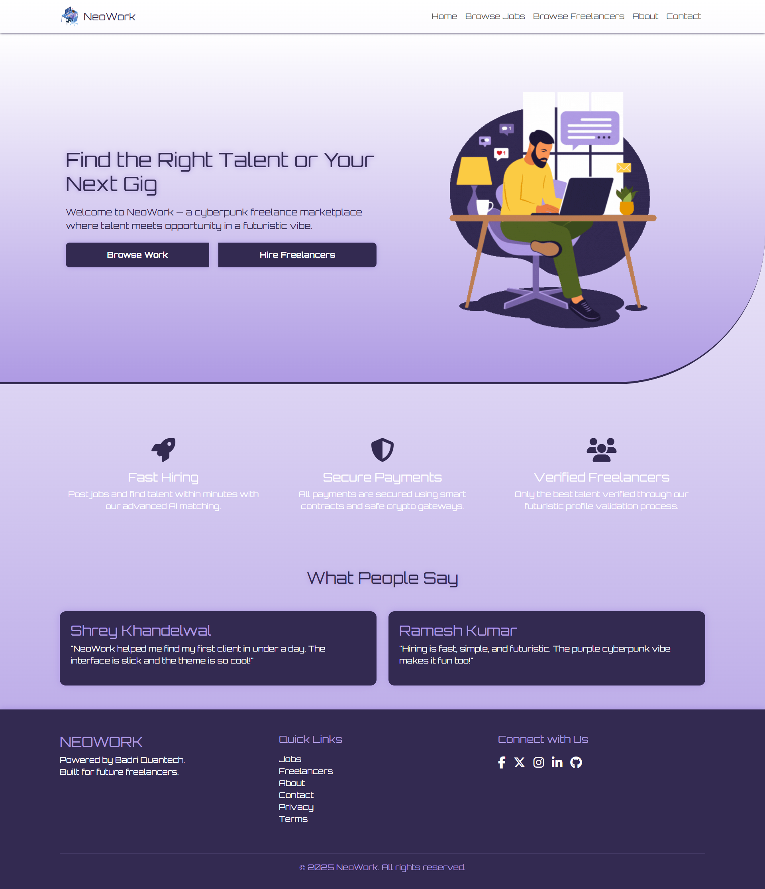

# NeoWork - Freelancer Marketplace 💼✨  

A modern freelancer marketplace platform designed to connect clients with skilled professionals.  
The **frontend** is fully developed and live, while **backend integration** is in progress.  

🔗 Live Website: [https://neowork-taher.netlify.app/](https://neowork-taher.netlify.app/)  

---

## 📖 About the Project  
**NeoWork** is a freelancer marketplace where users can:  
- Post and manage projects.  
- Browse and hire freelancers.  
- Showcase skills and portfolios.  

The project aims to provide a simplified yet powerful alternative to existing freelancing platforms, offering a smooth user experience, responsive UI, and scalable architecture.  

Currently, only the **frontend** is completed and deployed. The **backend** is under active development.  

---

## ✨ Features (Frontend)  
- 🖥️ **Modern UI** – Built with responsive layouts.  
- 📂 **Project Listings** – Showcase of jobs and gigs.  
- 👨‍💻 **Freelancer Profiles** – Skills, experience, and portfolios.  
- 🔍 **Search & Filter** – Easy project and talent discovery.  
- 🚀 **Responsive Design** – Works across all devices.  
- ✨ **Animations** – Smooth transitions and UI interactions.  

---

## 🛠️ Tech Stack  
- **Frontend:** React.js, HTML, CSS, Bootstrap  
- **Animations:** AOS (Animate on Scroll), Framer Motion (if used, confirm)  
- **Hosting:** Netlify (frontend deployment)  
- **Backend (In Progress):** Node.js, Express, MongoDB  
- **Version Control:** Git & GitHub  

---

## 📷 Screenshots  

- **Homepage**  
    

- **Browse Projects**  
    

- **Freelancer Profile**  
    

---

## 🚀 Deployment  
Frontend is deployed using **Netlify**:  
🔗 [https://neowork-taher.netlify.app/](https://neowork-taher.netlify.app/)  

Run locally:  
```bash
# Clone the repository
git clone https://github.com/mercyless22/neowork-frontend.git

# Navigate into the project folder
cd neowork-frontend

# Install dependencies
npm install

# Run the app
npm start
````

---

## 📌 Future Scope

* ✅ Complete **backend integration** with Node.js & MongoDB.
* ✅ Implement **JWT authentication** for users.
* ✅ Enable **real-time chat** between clients and freelancers.
* ✅ Add **payment gateway integration** for secure transactions.
* ✅ Create **admin dashboard** for project & user management.
* ✅ Deploy full-stack app (frontend + backend) on **Vercel/Render**.
* ✅ Improve SEO & performance optimization.

---

## 🤝 Credits

* **Design & Development (Frontend):** Taher M Travadi ([mercyless22](https://github.com/mercyless22))

---

## 📜 License

This project is licensed under the **MIT License** – free to use and modify with attribution.

---

⭐️ Developed by [Taher M Travadi](https://github.com/mercyless22) with ❤️
Do you also want me to create **two separate READMEs** (one for `neowork-frontend` repo and one for `neowork-backend` once it’s ready), so they are cleanly separated?
```
